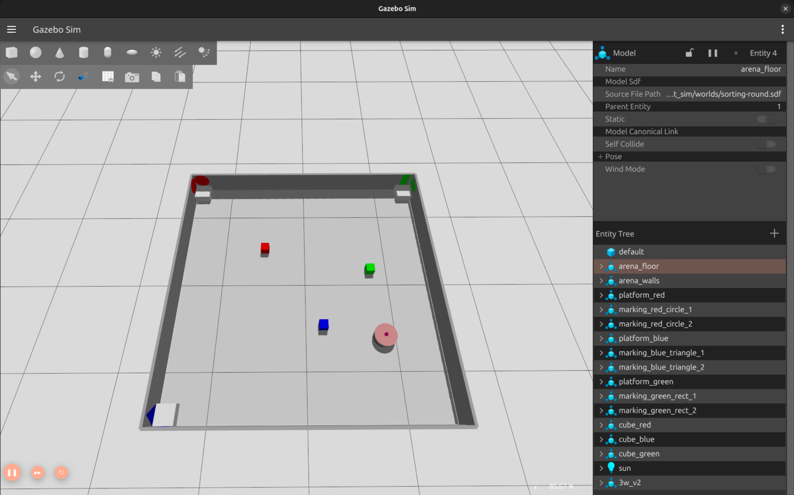
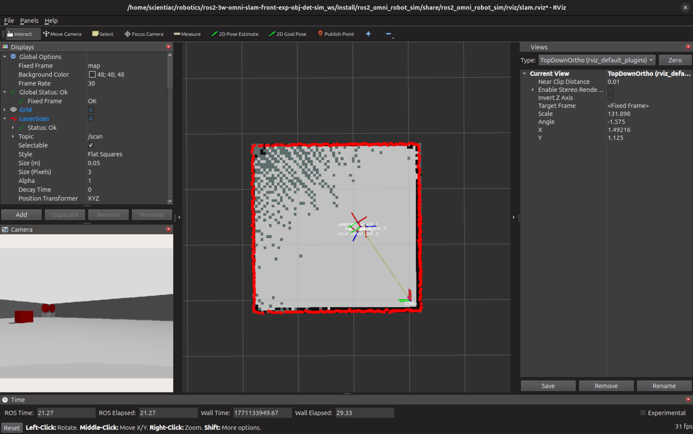
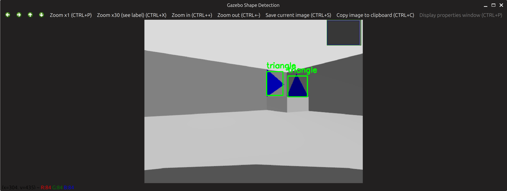
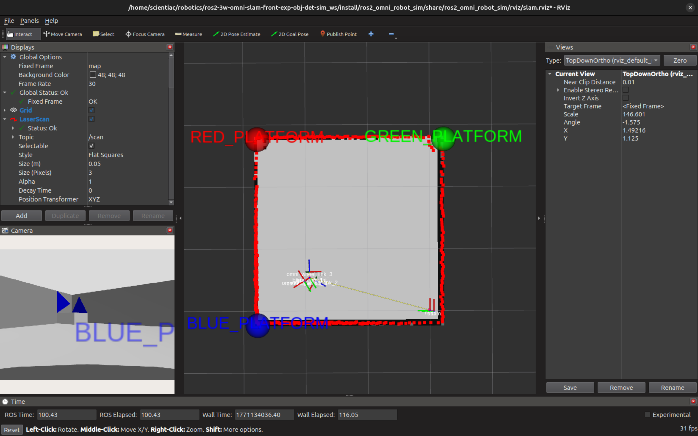

# ros2-3w-omni-slam-front-exp-obj-det-sim_ws
A ros2 jazzy and gazebo harmonic based simulation of a 3 wheeled omni robot that uses SLAM, Frontier Exploration and Shape Detection to navigate and flag the arena corners for detected shapes. 

## Launching the simulation.

Build the packages and source the files:
```bash
colcon build --symlink-install
source ./install/setup.bash
```

Launch the simulation:
```bash
ros2 launch ros2_omni_robot_sim exploration_all.launch.py
```

Add the `/dropoff_zones` node to visualize the arena corner flags in the R-viz window.

## Images

### Robot in the Arena inside Gazebo Simulation


### SLAM Frontier Exploration Visualization in R-viz


### Shape Detection using OpenCV


### Tagged Explored Corners in R-viz

